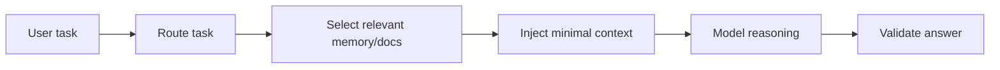

# Adaptive Context Injection

Dynamically inject only the memory, documentation, or state that is relevant to
the current task. This keeps prompts focused and avoids distracting the model
with unrelated history.

Use this when assistants have large memory stores, big documentation sets, or
long-running conversations.

This example filters a small memory dictionary and injects only entries that
match the task.

```powershell
python .\techniques\adaptive_context_injection\agent_example.py
```

## Realistic Scenarios

In an enterprise coding assistant, the agent may have access to thousands of
files, previous incidents, product requirements, user preferences, and design
docs. Injecting all of that into every request makes the model slower and less
accurate. Adaptive context injection retrieves only the pieces connected to the
current task, such as the failing module, the latest incident summary, or the
specific API contract being edited.

In a firmware debugging agent, this technique prevents the whole hardware manual
from entering the prompt. If the task mentions DMA channel 2 and UART RX, the
agent injects only the DMA and UART register notes, recent UART logs, and board
configuration.

Use this when context is large, mixed-quality, or frequently irrelevant. The key
design question is: "What information would a skilled engineer actually open
before solving this task?"

## Pipeline Stage

Use this during the **context assembly** stage, after routing and before the
model call. It decides which memory, files, docs, or logs should enter the
prompt.


