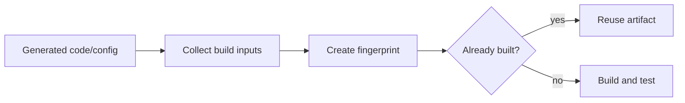

# Build Artifact Fingerprinting

Create stable hashes for build inputs such as source files, flags, board
configuration, and dependency versions. The fingerprint tells the workflow when
an artifact is already current and when it must be rebuilt.

Use this in firmware, CI, code generation, and compile-test loops.

This example hashes a simulated firmware build configuration.

```powershell
python .\techniques\build_artifact_fingerprinting\agent_example.py
```

## Realistic Scenarios

In firmware CI, an agent may repeatedly generate code, compile, test, and flash
images. Without artifact fingerprints, it may rebuild and reflash the same
binary many times. A fingerprint built from source files, compiler flags, linker
scripts, board revision, SDK version, and generated config lets the workflow skip
unnecessary work safely.

In infrastructure automation, the same idea applies to Terraform plans,
container images, generated configs, or deployment manifests. If the inputs have
not changed, the agent can avoid expensive validation or rollout steps.

Use this when build or deploy loops are slow, repeated, or easy for an agent to
trigger accidentally. The fingerprint becomes a deterministic memory of what has
already been proven.

## Pipeline Stage

Use this during **build planning and validation**, before rebuilds, reflashes, or
deployments. It prevents repeated work when inputs are unchanged.


