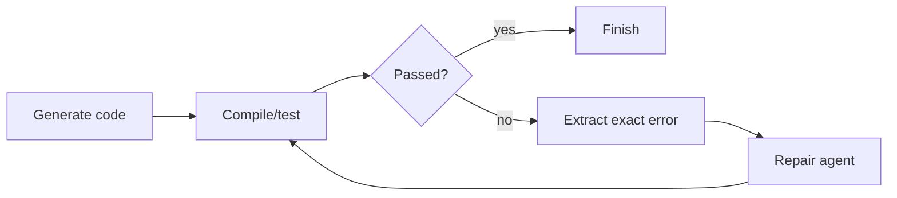

# Compiler Feedback Grounding

Feed exact compiler or runtime errors back into the repair step instead of
asking the model to guess what happened. Deterministic error text gives the
agent a concrete target.

Use this for code generation, firmware development, generated scripts, and
automated repair loops.

This example repairs a tiny source snippet using a simulated compiler error.

```powershell
python .\techniques\compiler_feedback_grounding\agent_example.py
```

## Realistic Scenarios

In a code generation agent, vague repair prompts like "fix the code" often cause
the model to invent problems. Compiler feedback grounding gives the agent exact
truth: file path, line number, error code, failing symbol, and test assertion.

In embedded development, this is especially powerful because GCC, Clang, linker
scripts, and static analyzers expose precise failures. The agent can repair a
missing include, bad register name, undefined ISR symbol, or linker region
overflow using evidence instead of guessing.

Use this whenever a deterministic tool can explain failure. The model should not
speculate about build state when the compiler already knows the answer.

## Pipeline Stage

Use this during the **repair loop** after build, test, or runtime validation
fails. The exact error becomes the next model input.


