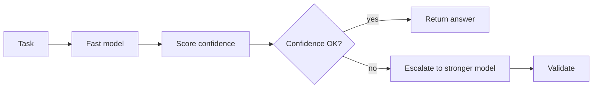

# Confidence-Based Escalation

Start with a cheap or fast model, then escalate only when confidence is low.
This reduces cost while preserving quality for uncertain tasks.

Use this in high-volume SaaS workflows, support bots, routers, and production
agent systems with mixed difficulty.

This example assigns a confidence score and chooses whether to use a stronger
model.

```powershell
python .\techniques\confidence_based_escalation\agent_example.py
```

## Realistic Scenarios

In a customer support agent, most questions may be simple policy lookups. A fast
model can answer those cheaply, while ambiguous billing disputes, legal wording,
or multi-account issues escalate to a stronger model or a human.

In a coding assistant, formatting, import sorting, and straightforward bug
classification can run on a small model. Race-condition debugging, architecture
review, and production incident reasoning should escalate.

Use this when cost or latency matters but quality cannot be sacrificed. The hard
part is defining confidence signals: schema validity, retrieval score, tool
success, disagreement between agents, or explicit uncertainty.

## Pipeline Stage

Use this during **model selection** and again after validation. It decides
whether the current answer is good enough or needs a stronger model.


