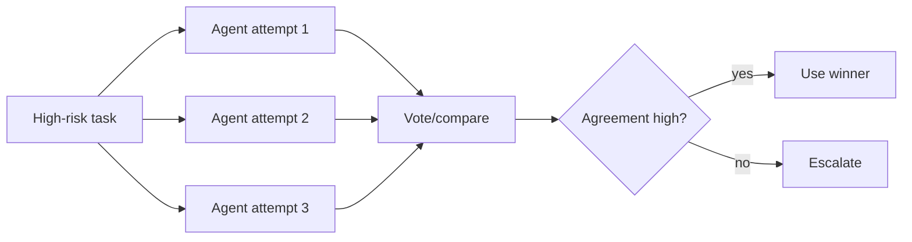

# Consensus Voting Agents

Run multiple independent agents or attempts, then choose the answer with the
strongest agreement. This improves robustness when single runs are unstable.

Use this for critical reasoning, planning, classification, and review tasks.

This example performs a simple majority vote over candidate answers.

```powershell
python .\techniques\consensus_voting_agents\agent_example.py
```

## Realistic Scenarios

For critical incident response, three independent agents can propose root causes
from logs, metrics, and recent deploys. If two converge on a database connection
pool exhaustion, the orchestrator can prioritize that hypothesis while still
recording minority opinions.

For compliance classification, multiple models or prompts can label a document,
then a voting layer selects the majority answer or escalates if disagreement is
high.

Use this when single-run answers are unstable and the cost of a wrong answer is
high. Voting is not magic; it works best when agents are genuinely independent
through different prompts, evidence slices, or model families.

## Pipeline Stage

Use this during **critical reasoning or decision selection**, after independent
agents produce candidate answers.


