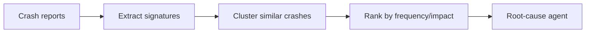

# Crash Signature Clustering

Group repeated crashes by stable signatures such as exception type, fault code,
or top stack frame. Clustering helps agents focus on recurring root causes.

Use this for firmware crash logs, backend incidents, mobile crash reporting, and
fleet diagnostics.

This example clusters crash strings by their prefix.

```powershell
python .\techniques\crash_signature_clustering\agent_example.py
```

## Realistic Scenarios

In a device fleet, thousands of crash reports may arrive from different boards
and firmware versions. Clustering by fault type, program counter range, stack
frame, assertion, or register snapshot lets an agent identify the top recurring
failures instead of reading every log.

In backend systems, the same pattern groups exceptions by stack trace signature
so the agent can separate a new release regression from background noise.

Use this when volume is high and individual failures are less useful than
patterns. Good clustering turns raw incidents into prioritized engineering work.

## Pipeline Stage

Use this during **log preprocessing and triage**, before root-cause analysis.
It turns many raw failures into a smaller set of recurring signatures.


