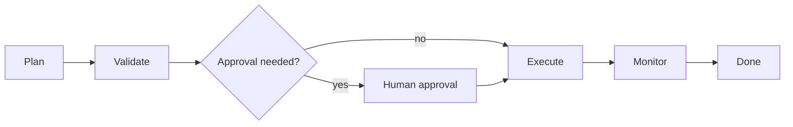

# Deterministic State Machines

Represent workflow execution as explicit states and transitions. The model can
help decide content, but the allowed path is controlled by code.

Use this for safety-critical flows, retries, firmware flashing, approvals, and
banking or deployment workflows.

This example walks through a fixed `plan -> validate -> execute -> done` graph.

```powershell
python .\techniques\deterministic_state_machines\agent_example.py
```

## Realistic Scenarios

In a production deploy agent, the allowed path might be: prepare plan, validate
diff, request approval, deploy canary, monitor metrics, expand rollout, finish.
The model can summarize risk, but code should decide which transitions are
legal.

In banking or firmware flashing, deterministic states prevent hallucinated
execution paths. An agent cannot skip validation or retry forever because the
state machine defines exactly what can happen next.

Use this when order, safety, retries, or auditability matter. Intelligence is
useful inside a state; deterministic code should own the workflow boundary.

## Pipeline Stage

Use this as the **orchestration backbone** for the whole workflow. Every risky
or multi-step agent system benefits from explicit states.


