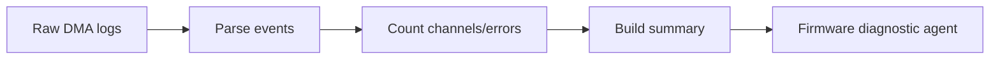

# DMA Event Summarization

Convert noisy DMA logs into structured event counts or timelines. This makes
low-level debugging easier for agents and humans.

Use this in firmware workflows with transfer-complete, transfer-error, and
channel-state logs.

This example counts simulated DMA transfer-complete and transfer-error events.

```powershell
python .\techniques\dma_event_summarization\agent_example.py
```

## Realistic Scenarios

In a networking firmware agent, raw DMA logs can contain thousands of transfer
complete, half-transfer, underrun, overrun, and error events. Summarizing them
into structured counts and timelines lets the model reason about behavior
without drowning in noise.

For high-throughput data acquisition systems, the agent can compare event rates
before and after a firmware change to detect regressions in buffer handling.

Use this when low-level logs are repetitive but contain important signal. The
summary should preserve counts, timestamps, channels, and error transitions.

## Pipeline Stage

Use this during **telemetry preprocessing**, before the diagnostic or reasoning
agent reads firmware logs.


