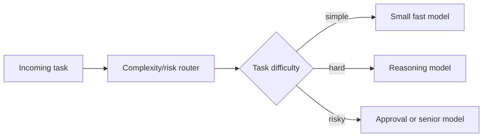

# Dynamic Model Routing

Route easy tasks to small fast models and difficult tasks to stronger reasoning
models. This reduces latency and cost without forcing every task through the
largest model.

Use this in production systems with mixed workloads, tool routers, and support
or coding assistants.

This example routes tasks based on simple complexity signals.

```powershell
python .\techniques\dynamic_model_routing\agent_example.py
```

## Realistic Scenarios

In a SaaS AI platform, millions of requests may include formatting, extraction,
summarization, debugging, planning, and code review. Routing every request to the
largest model wastes money. A router can send simple extraction to a fast model
and reserve reasoning models for complex or risky tasks.

In an internal engineering copilot, the router can inspect task length, touched
files, failure type, and production risk before selecting a model.

Use this when workload difficulty varies widely. Good routing is one of the
highest-leverage cost controls in large agent systems.

## Pipeline Stage

Use this at the **entry routing** stage before the main model call. It chooses
which model tier should handle the request.


