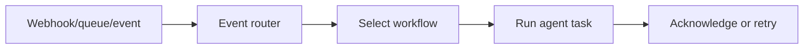

# Event-Driven Agent Architecture

Trigger agents from events or queues instead of polling continuously. This makes
distributed workflows more scalable and reduces idle compute.

Use this with queues, build systems, ticketing systems, deployment events, and
infrastructure automation.

This example processes a small in-memory event queue.

```powershell
python .\techniques\event_driven_agent_architecture\agent_example.py
```

## Realistic Scenarios

In CI/CD, agents should wake up when a build fails, a test completes, or a
deployment metric crosses a threshold. Polling wastes compute and creates
delays. Event-driven agents react immediately to queue messages.

In enterprise automation, support tickets, GitHub webhooks, Kafka streams, and
monitoring alerts can each trigger specialized workflows.

Use this when many workflows are idle most of the time. Queue-based design also
makes retries, backpressure, and horizontal scaling easier.

## Pipeline Stage

Use this as the **workflow trigger layer**. Instead of running agents constantly,
events start the right workflow at the right time.


