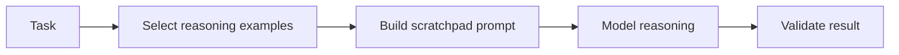

# Few-Shot CoT Scratchpads

Provide a few reasoning examples before the actual task so smaller models can
follow a reliable problem-solving pattern.

Use this for math, debugging, incident analysis, and multi-step logic tasks.

This example builds a prompt scratchpad with two compact reasoning examples.

```powershell
python .\techniques\few_shot_cot_scratchpads\agent_example.py
```

## Realistic Scenarios

In an incident triage agent, examples can teach the model to check recent
deploys, error rates, dependency health, and rollback options in a consistent
order. This improves smaller-model performance on multi-step reasoning.

In firmware debugging, examples can show how to reason from symptom, register
state, ISR timing, DMA events, and reproduction steps.

Use this when fast models fail because they skip steps. Keep examples short,
domain-specific, and focused on the reasoning pattern you want repeated.

## Pipeline Stage

Use this during **prompt construction** for reasoning-heavy tasks. It shapes how
the model approaches the problem before it generates an answer.


