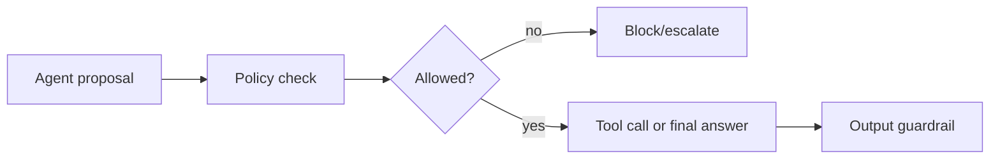

# Guardrail Validation Layers

Check prompts, tool calls, and outputs against policy before execution or
release. Guardrails reduce unsafe actions and compliance risk.

Use this for public-facing agents, infrastructure tools, finance flows, and code
execution systems.

This example blocks actions containing disallowed policy terms.

```powershell
python .\techniques\guardrail_validation_layers\agent_example.py
```

## Realistic Scenarios

In an infrastructure agent, guardrails can block public security group changes,
production database deletion, disabling audit logs, or pushing secrets into
repositories.

In a customer-facing assistant, guardrails can prevent unsafe advice, policy
violations, data leakage, or actions outside the user's authorization.

Use this whenever an agent can affect users, money, data, systems, or compliance
boundaries. Guardrails should run before tool execution and again before final
output when needed.

## Pipeline Stage

Use this at **pre-execution and pre-output** stages. It should check both what
the agent is about to do and what it is about to say.


