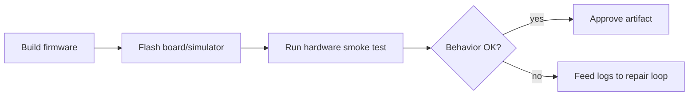

# Hardware-in-the-Loop Validation

Verify generated firmware behavior on real or simulated hardware instead of
accepting a model claim that something works.

Use this for firmware flashing, embedded validation, board bring-up, and device
fleet testing.

This example simulates sending a command to a board and checking the reply.

```powershell
python .\techniques\hardware_in_the_loop_validation\agent_example.py
```

## Realistic Scenarios

In firmware generation, compiling successfully is not enough. The agent may need
to flash a board, read UART output, check GPIO state, measure current draw, or
run a network packet test on real hardware.

In manufacturing test systems, HIL validation can confirm that generated
calibration code behaves correctly across multiple board revisions.

Use this when software correctness depends on physical behavior. The model can
suggest changes, but the board or simulator must verify reality.

## Pipeline Stage

Use this during **final validation**, after compile/tests and before declaring a
firmware change successful.


