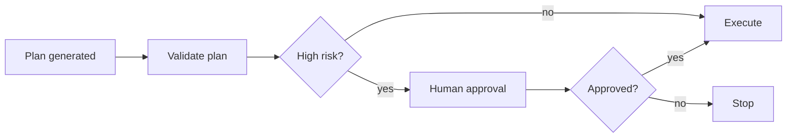

# Human-in-the-Loop

Pause automation for human approval before risky, expensive, destructive, or
irreversible steps.

Use this for production deploys, firmware flashing, payments, deletions, and
security-sensitive operations.

This example detects a risky firmware flashing action and pauses for approval.

```powershell
python .\techniques\human_in_the_loop\agent_example.py
```

## Realistic Scenarios

In a production deployment workflow, an agent can prepare the plan, validate
tests, summarize risk, and pause for approval before rollout. The human sees
evidence, not just a yes/no prompt.

In finance, legal, medical, or firmware flashing workflows, HITL prevents the
agent from taking irreversible actions without accountability.

Use this when the action is destructive, expensive, regulated, or hard to roll
back. The approval checkpoint should include context, risk, diff, and rollback
plan.

## Pipeline Stage

Use this as an **approval gate** before high-risk execution. It often sits after
planning and validation, but before deploy, flash, delete, or payment actions.


