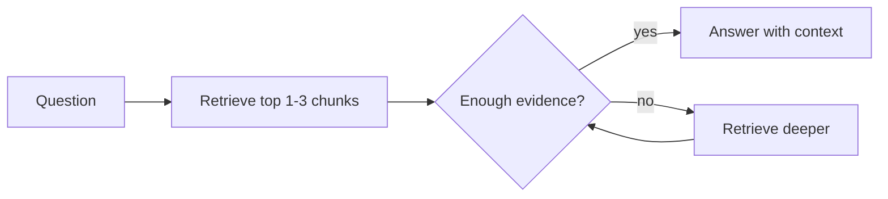

# Incremental Retrieval / Progressive RAG

Retrieve a small amount of context first, then fetch more only if the current
evidence is insufficient. This avoids paying for large retrievals on every task.

Use this for massive knowledge bases, manuals, legal corpora, and enterprise
search.

This example increases retrieval depth until a useful document appears.

```powershell
python .\techniques\incremental_retrieval_progressive_rag\agent_example.py
```

## Realistic Scenarios

In enterprise search, many questions can be answered from one or two high-quality
chunks. Retrieving twenty documents every time increases latency and distracts
the model. Progressive RAG starts small and expands only when confidence is low.

In hardware manuals, the agent might first retrieve the exact register entry,
then the peripheral overview, then errata only if the first context is
insufficient.

Use this when retrieval cost is high or knowledge bases are huge. Good systems
measure whether more context actually improves the answer.

## Pipeline Stage

Use this during **retrieval**, before prompt assembly. It controls how much
evidence is gathered for the model.


