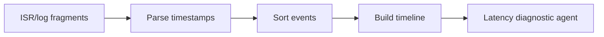

# Interrupt Timeline Reconstruction

Sort ISR and interrupt logs into chronological traces. Timelines help agents
reason about latency, priority inversion, and event ordering.

Use this for RTOS debugging, embedded telemetry, and performance analysis.

This example sorts simulated interrupt events by timestamp.

```powershell
python .\techniques\interrupt_timeline_reconstruction\agent_example.py
```

## Realistic Scenarios

In RTOS debugging, logs from UART, DMA, timers, and network interrupts may arrive
out of order. Reconstructing a timestamped ISR timeline helps identify priority
inversion, long interrupt handlers, missed deadlines, and starvation.

In high-frequency trading or telecom systems, event ordering can explain rare
latency spikes that are invisible in aggregate metrics.

Use this when causality matters. A model reasons much better from a timeline
than from unordered log fragments.

## Pipeline Stage

Use this during **log normalization**, before latency or root-cause analysis.
It converts unordered events into causal sequence.


