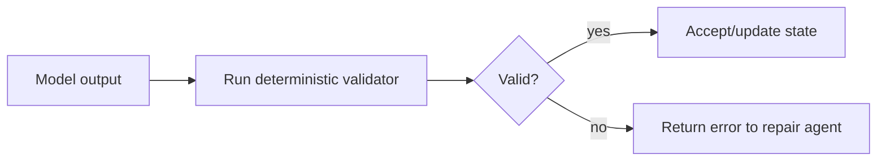

# Local Validation Grounding

Validate model outputs with deterministic local code, tests, schemas, or system
checks. The runtime result becomes the source of truth.

Use this for generated code, build systems, infrastructure checks, and API
automation.

This example validates a model's JSON claim that a build compiled.

```powershell
python .\techniques\local_validation_grounding\agent_example.py
```

## Realistic Scenarios

In a coding agent, the model may claim a fix works. Local validation runs tests,
type checks, lint, compilation, or smoke tests to confirm. The workflow trusts
the tool result over the model's statement.

In infrastructure automation, validation might run `terraform plan`, policy
checks, connectivity tests, or dry-run deploys before execution.

Use this whenever external truth exists. Models are useful for generating
hypotheses; validators decide whether the hypothesis survived reality.

## Pipeline Stage

Use this after **model generation and before acceptance**. It is the truth gate
for code, config, infrastructure, and generated actions.


