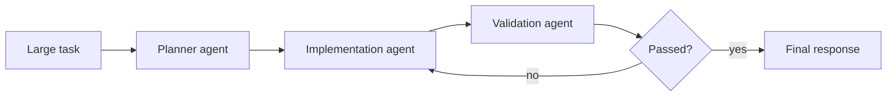

# Micro-Agent Splitting

Split one large agent prompt into smaller specialized agents. Each agent owns a
clear stage and can use a model size appropriate to its job.

Use this for codegen pipelines, firmware workflows, compile-test loops, and
complex automation where one giant prompt becomes confused or slow.

This example runs planner, coder, and tester agents as a simple pipeline.

```powershell
python .\techniques\micro_agent_splitting\agent_example.py
```

## Realistic Scenarios

A large coding workflow can be split into a planner agent, implementation agent,
test repair agent, reviewer agent, and release-note agent. Each receives a small
focused prompt and can use a different model tier.

In firmware automation, one agent can parse logs, another can retrieve register
context, another can propose code changes, and another can validate with build
and HIL tests.

Use this when one giant prompt becomes slow, confused, or hard to debug. The
design goal is clean ownership: each micro-agent should have one job and one
clear output contract.

## Pipeline Stage

Use this at the **workflow decomposition** stage. It defines which specialist
agents exist and how work moves between them.


