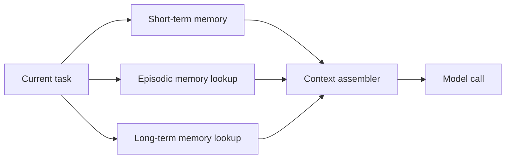

# Multi-Level Memory Hierarchy

Separate short-term, episodic, and long-term memory instead of putting all
context into every prompt.

Use this for persistent copilots, support agents, user personalization, and
long-running workflows.

This example shows three memory layers represented as simple data structures.

```powershell
python .\techniques\multi_level_memory_hierarchy\agent_example.py
```

## Realistic Scenarios

A persistent engineering assistant may need current task state, previous bug
fixes, team conventions, and long-term project architecture. Putting all memory
into every prompt is wasteful. Separate memory layers let the agent retrieve
only what matters.

For customer support, short-term memory is the current ticket, episodic memory is
previous interactions, and long-term memory is account metadata or product
configuration.

Use this when assistants run across sessions. Treat the model like a CPU and
store durable truth in databases, not prompt history.

## Pipeline Stage

Use this during **memory retrieval and state persistence**. It decides what
lives in short-term prompt state versus durable storage.


