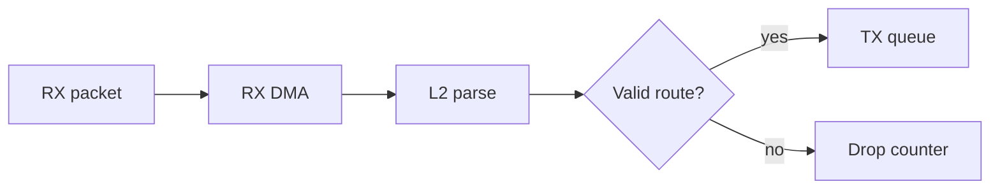

# Packet Flow Graph Modeling

Represent packet processing as graph state rather than loose prose. This helps
agents reason deterministically through L2/L3 pipelines.

Use this for networking firmware, routers, dataplanes, firewalls, and packet
debugging.

This example walks a tiny RX-to-TX packet flow graph.

```powershell
python .\techniques\packet_flow_graph_modeling\agent_example.py
```

## Realistic Scenarios

In a router, firewall, or NIC firmware pipeline, packets move through RX DMA,
L2 parsing, VLAN handling, IP routing, ACL checks, NAT, QoS, and TX queues.
Representing this as a graph helps an agent reason about where packets are
dropped or delayed.

In production network debugging, graph state can connect packet counters,
policy rules, route tables, and trace samples into one deterministic path.

Use this when prose descriptions of packet flow become ambiguous. Graphs make
branching, drops, and transformations explicit.

## Pipeline Stage

Use this during **domain modeling and diagnostic reasoning**. It gives the agent
a deterministic map before it explains packet behavior.


