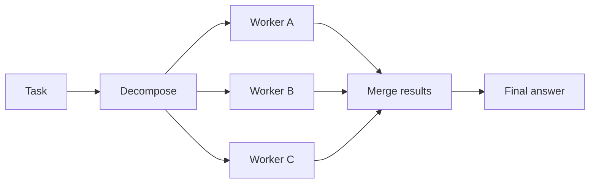

# Parallel Agent Fan-Out

Run independent subtasks concurrently to reduce wall-clock time. Parallelism is
often the biggest latency win in agent systems.

Use this for multi-file analysis, independent retrieval, validation, research,
and batch diagnostics.

This example analyzes three files concurrently with a thread pool.

```powershell
python .\techniques\parallel_agent_fan_out\agent_example.py
```

## Realistic Scenarios

In a code review agent, independent workers can inspect API changes, database
migrations, frontend behavior, security risks, and tests at the same time. The
orchestrator then merges findings.

In research agents, separate workers can search docs, source code, logs, and
metrics concurrently. This reduces wall-clock time dramatically when tasks do
not depend on each other.

Use this when subtasks are independent and slow. Avoid fan-out when tasks share
mutable state or when merging results would cost more than the parallelism saves.

## Pipeline Stage

Use this during **parallel analysis or retrieval**, after task decomposition and
before result synthesis.


