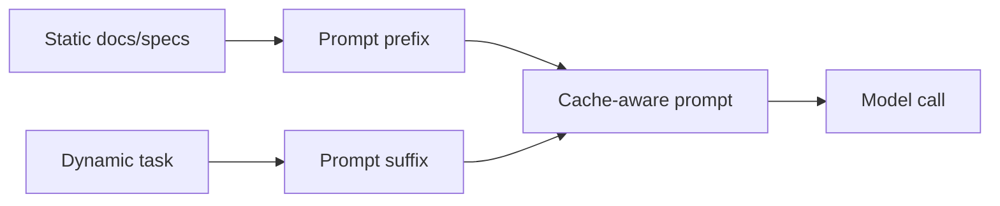

# Prompt Caching Layouts

Put stable, repeated context at the beginning of prompts so providers or local
caches can reuse it across calls.

Use this for API specs, register maps, protocol documents, coding standards, and
repeated workflows with identical prefixes.

This example caches answers using a stable static-context prefix key.

```powershell
python .\techniques\prompt_caching_layouts\agent_example.py
```

## Realistic Scenarios

If every request includes the same API spec, hardware register map, coding
standard, or product policy, place that stable material at the beginning of the
prompt. Many providers can reuse cached prefix computation, reducing latency and
cost.

In a firmware assistant, the static prefix might include board family, compiler
rules, and register documentation. The dynamic task comes after.

Use this when many calls share the same context. Cache-friendly prompt layout is
a simple design choice that can produce large performance gains.

## Pipeline Stage

Use this during **prompt assembly**, before the model call. Static content should
be placed first so repeated prefixes can be cached.


