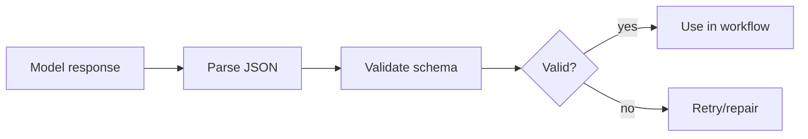

# Pydantic Structured Outputs

Force model output into a known schema before using it in routers, tools, state
updates, or configuration generation.

Use this when regex parsing fails, JSON is malformed, or branching becomes
unstable.

This example parses JSON into a typed route decision object and validates
required fields.

```powershell
python .\techniques\pydantic_structured_outputs\agent_example.py
```

## Realistic Scenarios

In a workflow router, the model might return a route, risk level, confidence,
required tools, and approval requirement. Free-form text is fragile; schema
validated output lets code branch safely.

In config generation, structured output prevents missing fields, malformed JSON,
or accidental prose from reaching deployment tools.

Use this when model output feeds code. If another system will parse it, make the
contract explicit and validate before using it.

## Pipeline Stage

Use this at the **model-output boundary**, before routers, tools, state updates,
or config writes consume the result.


