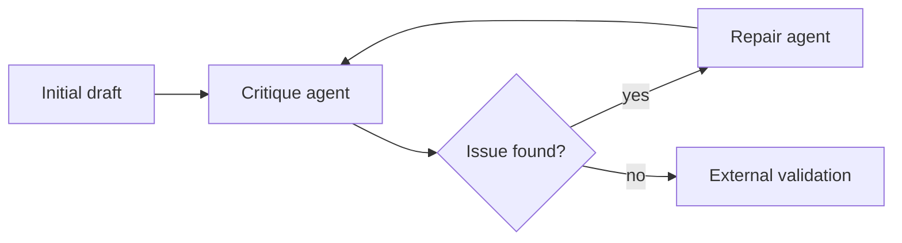

# Reflection Loops

Let an agent critique and repair its own output in bounded iterations. The loop
should have clear stopping conditions and external validation when possible.

Use this for code generation, planning, summarization quality checks, and tasks
with known failure modes.

This example generates code, detects a missing guard, and repairs it.

```powershell
python .\techniques\reflection_loops\agent_example.py
```

## Realistic Scenarios

In code generation, a first pass may solve the happy path but miss null checks,
edge cases, or tests. A reflection step can inspect the draft against a checklist
before validation runs.

In planning workflows, reflection can ask whether the plan has rollback,
monitoring, ownership, and approval steps.

Use this when outputs often need polishing but the loop can be bounded. Do not
let reflection replace external validation; it should improve candidates before
tests, not declare success by itself.

## Pipeline Stage

Use this during **draft improvement**, after initial generation and before
external validation.


