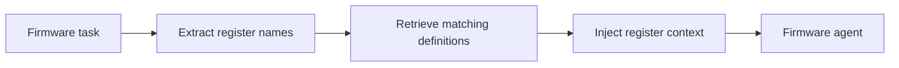

# Register-Aware Retrieval

Retrieve only the hardware register definitions relevant to the current
firmware task instead of injecting an entire manual.

Use this for embedded systems, firmware debugging, silicon documentation, and
register-level code generation.

This example looks up a matching register description from a tiny register map.

```powershell
python .\techniques\register_aware_retrieval\agent_example.py
```

## Realistic Scenarios

In embedded debugging, a chip manual may be thousands of pages. If the task is
about `USART_CR1` or `DMA_CCR`, the agent should retrieve those exact register
definitions, reset values, bit meanings, and errata, not the whole manual.

In code generation, register-aware retrieval can prevent invalid bit names and
wrong peripheral assumptions.

Use this when hardware documentation is large and precise. The retrieval key
should include peripheral name, register name, bit field, chip revision, and
board variant when available.

## Pipeline Stage

Use this during **domain-specific retrieval**, before prompt assembly for
firmware reasoning or code generation.


