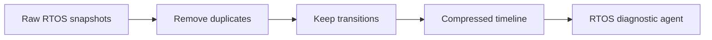

# RTOS State Snapshot Compression

Compress repeated RTOS task-state snapshots so long debugging sessions do not
fill the context window with duplicate state.

Use this for embedded tracing, task scheduling analysis, and long-duration
firmware diagnostics.

This example removes consecutive duplicate snapshots.

```powershell
python .\techniques\rtos_state_snapshot_compression\agent_example.py
```

## Realistic Scenarios

An RTOS trace may record task states every millisecond. Most snapshots are
duplicates. Compression can keep only state transitions, CPU ownership changes,
queue depth changes, and deadline misses.

In long-duration embedded tests, this allows an agent to analyze hours of
behavior without filling the prompt with repeated "ready" or "blocked" states.

Use this when state changes slowly relative to sampling frequency. Preserve
transition times because timing is often the real bug.

## Pipeline Stage

Use this during **embedded trace preprocessing**, before the diagnostic agent
analyzes scheduler behavior.


