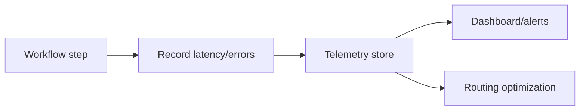

# Runtime Telemetry Feedback

Capture latency, error, retry, cache, and utilization metrics, then feed those
signals back into orchestration decisions.

Use this for production agent platforms that need continuous optimization and
bottleneck detection.

This example records a few simulated latencies and prints a telemetry summary.

```powershell
python .\techniques\runtime_telemetry_feedback\agent_example.py
```

## Realistic Scenarios

In production agent platforms, telemetry shows where time and money go: routing,
retrieval, model calls, tools, retries, validation failures, and human approval
waits. Without telemetry, optimization is guesswork.

An orchestrator can use telemetry to route away from failing tools, increase
cache investment, lower retrieval depth, or escalate models only where needed.

Use this from the first production prototype. Every workflow should report
latency, cost, model choice, cache behavior, failures, and retry counts.

## Pipeline Stage

Use this across the **entire runtime**. Every major workflow step should emit
metrics that can improve future routing and orchestration.


