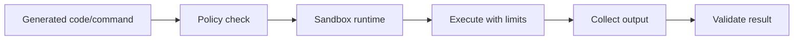

# Sandbox Execution Isolation

Run generated or untrusted code in an isolated environment rather than on the
host machine.

Use this for codegen agents, terminal agents, plugin systems, and any workflow
that executes model-created code.

This example builds a Docker-style command for isolated execution.

```powershell
python .\techniques\sandbox_execution_isolation\agent_example.py
```

## Realistic Scenarios

Code agents often generate scripts, tests, migrations, or shell commands. Running
that code directly on a host can expose secrets, delete files, or access the
network. Sandboxes limit filesystem, network, CPU, memory, and time.

In enterprise environments, generated code can run in Docker, Firecracker,
Kubernetes jobs, or locked-down CI workers before any result is trusted.

Use this whenever model-generated code or commands execute. Treat generated code
as untrusted input even when the user requested it.

## Pipeline Stage

Use this at the **execution boundary**, before generated code, shell commands,
or tests run.


