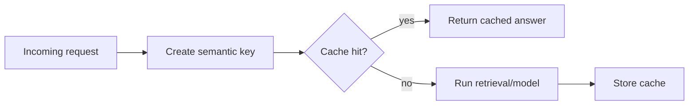

# Semantic Caching

Cache responses for prompts that are semantically similar, not just identical.
This can greatly reduce latency and cost for repeated support-style requests.

Use this for FAQs, customer support, internal helpdesk bots, and high-volume
query systems.

This example creates a normalized semantic key for similar password-reset
questions.

```powershell
python .\techniques\semantic_caching\agent_example.py
```

## Realistic Scenarios

Support bots often receive many versions of the same question: "reset my
password", "can't log in", and "forgot credentials". Semantic caching can reuse
answers when meaning is close enough, reducing latency and cost.

In internal copilots, repeated policy, onboarding, and troubleshooting questions
can be served from cache while unusual requests still go to retrieval and model
reasoning.

Use this when requests repeat in meaning but not exact wording. Add freshness
rules for policies, prices, incidents, and other changing information.

## Pipeline Stage

Use this near the **request entry point**, before retrieval or model calls. It
can short-circuit repeated semantic requests.


