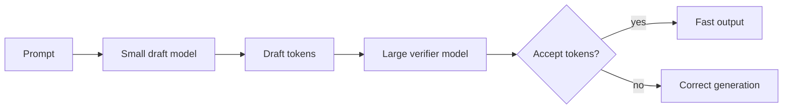

# Speculative Decoding Pipelines

Use a small fast model to draft tokens while a larger model verifies or corrects
the draft. In real serving stacks, this reduces generation latency.

Use this for high-throughput chat, inference servers, and GPU-bound model
serving.

This example simulates draft generation followed by large-model verification.

```powershell
python .\techniques\speculative_decoding_pipelines\agent_example.py
```

## Realistic Scenarios

High-throughput chat systems can use a small model to draft likely tokens while
a larger model verifies them. When the draft matches the large model's path,
generation speeds up.

In self-hosted inference, vLLM or TensorRT-LLM style serving optimizations can
reduce token latency under heavy load.

Use this at the serving layer when decoding latency is a bottleneck. It is less
about workflow design and more about efficient model inference infrastructure.

## Pipeline Stage

Use this inside the **model serving layer**, after the prompt is ready and while
tokens are being generated.


