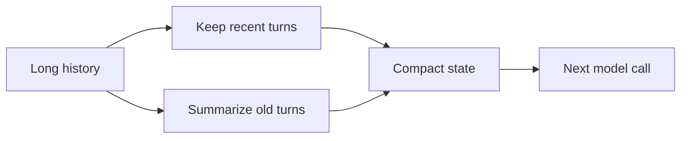

# State Pruning and Message Truncation

Summarize or remove irrelevant old chat history and keep only useful recent
state. This prevents context growth from degrading reasoning.

Use this for long-running debugging agents, repair loops, support chats, and
multi-step workflows.

This example compacts old messages into one summary and keeps the latest turns.

```powershell
python .\techniques\state_pruning_message_truncation\agent_example.py
```

## Realistic Scenarios

Long debugging sessions can contain hundreds of tool outputs, failed attempts,
logs, and partial hypotheses. If all history stays in the prompt, reasoning
gets slower and less focused. State pruning keeps recent details and summarizes
older facts.

In customer support, old conversation turns can be compressed into issue,
customer identity, attempted fixes, and current blocker.

Use this when token count grows over time. Summaries should preserve decisions,
constraints, evidence, and open questions.

## Pipeline Stage

Use this during **conversation/state maintenance**, before each new prompt is
assembled for a long-running workflow.


