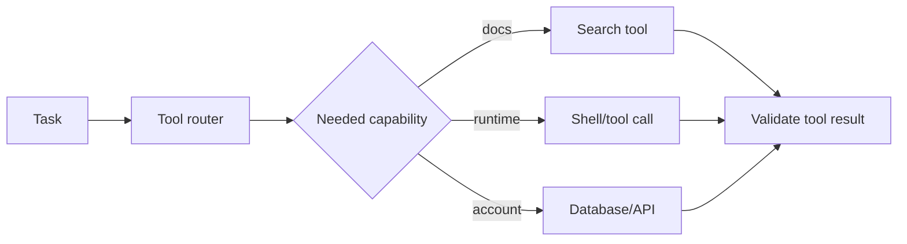

# Tool Selection Routers

Use a lightweight router to select the right tool before invoking expensive or
state-changing operations.

Use this when agents have many tools, call the wrong tool often, or waste time
probing unnecessary systems.

This example routes compile-like tasks to a shell diagnostic and other tasks to
search.

```powershell
python .\techniques\tool_selection_routers\agent_example.py
```

## Realistic Scenarios

An engineering agent may have access to search, shell, database queries, ticket
systems, deployment tools, and observability dashboards. A lightweight router can
choose the right tool before expensive or risky calls happen.

In customer support, the router may decide between knowledge base lookup,
account lookup, refund workflow, or human escalation.

Use this when agents call too many tools or choose poorly. Tool selection should
consider task intent, permissions, risk, and whether the needed data is already
available.

## Pipeline Stage

Use this before **tool execution**. The router decides whether the agent should
search, query a database, run shell, inspect logs, or ask for approval.


