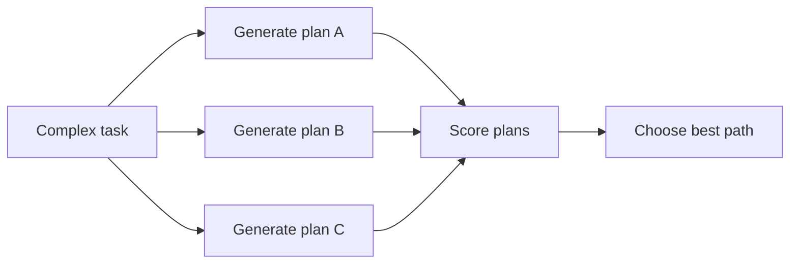

# Tree-of-Thought Execution

Explore multiple candidate reasoning paths before choosing one. This improves
planning quality when a single direct answer often fails.

Use this for complex planning, proofs, architecture decisions, and difficult
debugging.

This example scores several plans and chooses the strongest candidate.

```powershell
python .\techniques\tree_of_thought_execution\agent_example.py
```

## Realistic Scenarios

For complex architecture decisions, an agent can explore several plans:
incremental migration, full rewrite, adapter layer, or hybrid rollout. Each path
can be scored for risk, cost, reversibility, and testability.

In incident response, multiple root-cause hypotheses can be explored before
choosing the next diagnostic action.

Use this when one-shot reasoning often picks a shallow path. Bound the number of
branches, score them explicitly, and preserve why the winning branch was chosen.

## Pipeline Stage

Use this during **complex planning**, before committing to one execution path.


