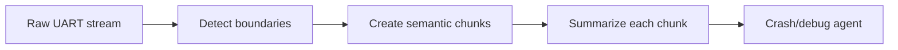

# UART Log Chunking

Split raw UART logs into semantic chunks before analysis. Chunking prevents
token overflow and keeps crash diagnosis focused.

Use this for firmware boot logs, serial traces, embedded crash reports, and
device diagnostics.

This example splits a UART log stream into boot-session chunks.

```powershell
python .\techniques\uart_log_chunking\agent_example.py
```

## Realistic Scenarios

UART logs from embedded devices often include repeated boot sequences, noisy
driver messages, counters, and crash dumps. Chunking by boot marker, timestamp
gap, fault marker, or subsystem lets an agent analyze each meaningful segment.

In board farm testing, chunked logs can be compared across devices to find the
first divergence between passing and failing units.

Use this when raw serial output is too large or repetitive. Good chunks preserve
session boundaries and the events immediately before failure.

## Pipeline Stage

Use this during **log ingestion**, before retrieval, summarization, or crash
diagnosis.


